<p align="center">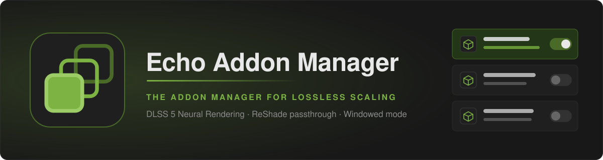</p>

<p align="center"><b>Lossless Scaling, extended.</b><br>DLSS 5 Neural Rendering, DLSS and FSR upscaling for games that never had them, and an addon manager that keeps it all in one window.</p>

<p align="center">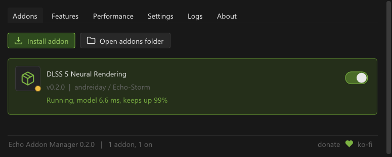</p>

**Addon Manager for Lossless Scaling** (LS Addon Manager for short) loads alongside [Lossless Scaling](https://store.steampowered.com/app/993090/Lossless_Scaling/) and gives it an
addon system. It comes with three addons that do what Lossless Scaling alone cannot: **DLSS 5 Neural Rendering** gives any game a new look, and the **DLSS** and
**FSR Upscalers** put a real temporal upscaler in place of Lossless Scaling's NIS scaler (FSR 4 included, on any card), so old games that never had DLSS or FSR get one. Around them, the manager
installs and switches addons, shows the machine's load at a glance, says what limits your frame rate, and backs every setting up. It is free and MIT-licensed, and an
unofficial project, not affiliated with the Lossless Scaling developers: read the [disclaimer](DISCLAIMER.md) before you install it.

[](https://github.com/Echo-Storm/ls-addon-manager/actions/workflows/build.yml)

Status: **0.9.5**, getting ready for 1.0 (the [roadmap](ROADMAP.md) says what is left). You need Lossless Scaling 3.2.2.0 and Windows 10 or 11, x64.

> [!TIP]
> **New in 0.9.5:** **FSR 4 on any graphics card** (the OptiScaler team's build, one click in the FSR Upscaler), a **Runtimes** list that shows every DLSS and FSR
> file with its version and signature and switches them while you play, **vibrance, saturation, shadows, highlights, brightness, contrast and gamma** in both
> upscalers, a third DLSS model (**E**), **HDR games** in Neural Rendering, and a **recorder** that turns a bug into a file we can replay (Ctrl+Shift+F5).
> The [release notes](https://github.com/Echo-Storm/ls-addon-manager/releases/tag/v0.9.5) and the [changelog](CHANGELOG.md) have the rest.

> [!IMPORTANT]
> **DLSS 5 Neural Rendering needs a file you provide yourself:** your own copy of `nvngx_dlssnr.dll`. It is **not included**, this project **does not download it**,
> and it does not say where to get it. Put your copy next to `LosslessScaling.exe` (Setup and the addon's **Browse for the model file...** button can copy it there),
> then press **Test compatibility** in the addon's panel. Everything else, the two upscalers included, works without it.

> [!NOTE]
> **Tested with World of Warcraft: Forever and Fallout: New Vegas** (Tale of Two Wastelands), on Lossless Scaling 3.2.2.0, Windows 11 and an RTX 4070 Ti SUPER.
> Other games and setups are untested so far; reports are welcome.

## Contents

- [What is in it](#what-is-in-it): the three addons, the built-in features, and the manager
- [Get started](#get-started)
- [Screenshots](#screenshots)
- [Using it](#using-it) and [the hotkeys](#hotkeys), [keeping it up to date](#keeping-it-up-to-date), [if something goes wrong](#if-something-goes-wrong), [installing by hand](#installing-by-hand)
- [How it works](#how-it-works), [build from source](#build-from-source), [writing an addon](#writing-an-addon), [credits](#credits)

## What is in it

| | What it is | Needs | Default |
|---|---|---|---|
| **DLSS 5 Neural Rendering** | NVIDIA's neural rendering model on every frame Lossless Scaling shows: a new look for any game | NVIDIA RTX, your own model file | on |
| **DLSS Upscaler** | NVIDIA DLSS in place of Lossless Scaling's NIS scaler: upscaling, or DLAA at the screen's own size | NVIDIA RTX (runtime included) | off |
| **FSR Upscaler** | AMD FSR 3.1, or FSR 4, in the same place, on any graphics card | any DirectX 12 GPU (runtime included) | off |
| **ReShade input passthrough** | Mouse and keyboard reach a ReShade overlay while Lossless Scaling scales the game | ReShade | off |
| **Windowed mode and second monitor** | Lossless Scaling with a windowed game, or on a second monitor | | off |

The first three are addons (each can be switched on and off, or removed); the last two are built into the manager (the Features tab).

### DLSS 5 Neural Rendering

Runs NVIDIA's DLSS 5 neural model on Lossless Scaling's frames and puts the result on **every frame it presents, real and generated**, without ever making Lossless
Scaling wait for it.

- **Works with frame generation on or off.** With it on, the model runs on the captured frames and its result is slid onto the generated ones along Lossless Scaling's
  own motion. With it off, the model takes the presented frame; the result of the frame before is moved along the measured motion, so nothing waits.
- **Its own motion measurement.** The model gets motion vectors measured from the frames themselves, per pixel and for the frame itself, rather than frame generation's
  quarter-size flow: the picture holds together while the camera turns.
- **Saved looks** (sets of sliders under a name), **a look per game** that follows the game in focus, and a hotkey to cycle them.
- **Keep the HUD untouched:** take a snapshot of the game and draw the areas the model must leave alone (action bars, chat, the minimap); saved with each look.
- **Picture controls:** intensity, fine detail, local contrast, skin detail, sharpening, tone, colour and vibrance, shadows and highlights, film grain, temporal smoothing
  and a ghost guard that fades the result where the motion cannot be trusted.
- **HDR games too:** 16-bit (scRGB) and 10-bit (HDR10) frames are worked on through an SDR view of them, and only the change goes back, so
  highlights keep their brightness. Automatic, with a *Frame encoding* setting for a setup it gets wrong.
- **Compare while you play:** before / after, a split view, screenshots of what you see ([hotkeys](#hotkeys) Ctrl+Shift+F6 to F11).
- **Auto quality:** keeps the model within a time budget by picking its resolution; changing it never stalls the game.
- **Requirements check** and a **compatibility test** that tries the model on your card before you play.

About 2.7 ms plus 1.8 ms per megapixel of model input on an RTX 4070 Ti SUPER (5.2 ms at 1912x1080). [The addon's README](addons/DLSS5NR01/README.md) has the rest.

### DLSS and FSR Upscalers

<p align="center">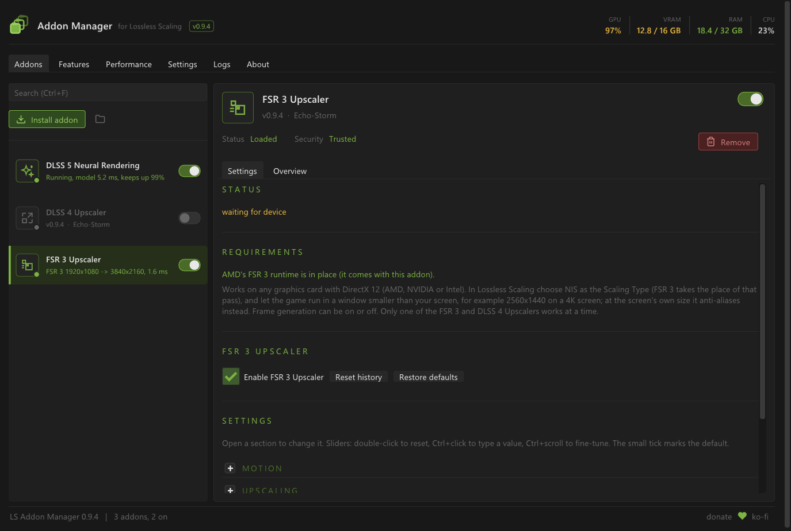</p>

Lossless Scaling scales a game window up to the screen with a spatial scaler. These two addons put a **temporal upscaler** in that place: DLSS or FSR reads several
frames and the motion between them, which gives a steadier, more detailed picture than scaling one frame at a time. Games that never had DLSS or FSR get one, with no
support from the game: **the addons measure the motion from the frames themselves.** In Lossless Scaling choose **NIS** as the Scaling Type and run the game in a window
smaller than the screen (for example 2560x1440 on a 4K screen); at the screen's own size they anti-alias instead (DLAA, FSR native AA).

- **DLSS Upscaler:** NVIDIA DLSS Super Resolution with the model of your choice: NVIDIA's default K (DLSS 4), DLSS 4.5's M, or DLSS 3's E,
  which keeps a still picture crisper here. NVIDIA RTX.
- **FSR Upscaler:** AMD FidelityFX Super Resolution with AMD's own sharpening (RCAS). Any DirectX 12 graphics card: AMD, NVIDIA or Intel.
  *FSR version*, right under its Enable switch, picks AMD's FSR 3.1.4 (shipped, signed) or **FSR 4**: the OptiScaler team's 4.1.1b INT8
  build, AMD's machine-learning upscaler made to run on cards AMD's own FSR 4 does not support, NVIDIA's included. It follows a moving
  picture noticeably better. Switching takes a second while the game runs.
- **Frame generation on or off**, every frame it presents, real and generated.
- **4:3 and other window shapes:** a window of another shape than the screen is upscaled into the part of the screen Lossless Scaling puts it in, borders left alone.
- **Stability:** less shimmer on thin lines, wires and leaves (the upscaler averages the flicker out), while thin things that move stay sharp. FSR 4 does this by itself.
- **Edge smoothing:** anti-aliasing of the upscaled picture's edges, for older games without anti-aliasing of their own.
- **Sharpening** from none to well past the upscaler's own maximum.
- **Colour and tone:** vibrance, saturation, shadows, highlights, brightness, contrast and gamma, applied before upscaling, so they cost
  nothing. While DLSS 5 Neural Rendering is on, its own Picture controls take over, so nothing is applied twice.
- **Settings per game:** sharpening, stability, edge smoothing, colour and tone, the model and the motion are kept for each game and come back when it
  takes focus.
- **Before / after** hotkey to compare with NIS while you play, and a line of live numbers (pictures a second, how many waited or repeated).
- Only one of the two runs at a time; both work beside Neural Rendering.

What they cost on an RTX 4070 Ti SUPER (everything the addon does, the motion measurement included):

| | DLSS (model K) | FSR 3.1 |
|---|---|---|
| 1920x1080 -> 3840x2160 | | about 1.5 ms |
| 2560x1440 -> 3840x2160 | about 2.4 ms | about 1.85 ms |
| 3840x2160 at 1:1 (anti-aliasing) | about 3.2 ms | about 2.2 ms |

FSR 4 costs more than FSR 3.1 (it is a neural network, and on cards without AMD's matrix hardware it runs in an INT8 form): the panel's status line shows what it
takes on yours, and *FSR version* switches back in a second.

**Which one?** On an NVIDIA RTX card try both: DLSS smooths edges better by itself, FSR 3.1 costs less and keeps text crisper, and FSR 4 is the best in motion. On any other card, FSR. If the game has
anti-aliasing of its own (MSAA), switch it on: it draws what no upscaler can put back, such as wires thinner than a pixel. The [upscalers' guide](addons/DLSS5NR01/docs/upscalers.md)
covers the settings, what to expect and what to do when something is wrong.

### Built into the manager

| Feature | What it does |
|---------|--------------|
| **ReShade input passthrough** | Lets the mouse and keyboard reach a ReShade overlay while Lossless Scaling is scaling the game. A hotkey (Home by default) turns it on and off. |
| **Windowed mode and second monitor** | Adds a virtual display the size of your game window so Lossless Scaling works with a windowed game or a second monitor, with split-screen and side-by-side options. Switching it on needs a restart of Lossless Scaling; switching it off is immediate. |

### The manager

- **The machine at a glance.** The header shows the graphics card's load and memory, system memory and the processor, on every tab; memory turns amber, then red,
  as it fills. Hover it for the card's name, temperature, power and clocks.
- **A Performance tab that explains itself:** frame rate and frame times (average, slowest 5%, worst), what each addon costs, the GPU's load, power against its limit,
  clocks, temperature and memory, and a plain-words reading ("the GPU is at its power limit").
- **Install and remove addons without touching folders.** *Install addon* takes a folder, a zip or a lone DLL, or drop one on the window. New addons arrive
  switched off. *Remove* moves an addon into `addons\.removed` after asking; nothing is ever erased.
- **Runtimes, at the bottom of the addon list.** Every file the addons run on (NVIDIA's DLSS, AMD's FSR, your Neural Rendering model) with
  its version, a tick when it is loaded, a circle when its addon waits for a game, a cross when its addon is off, and *unsigned* or
  *modified* when the file is not as its maker signed it. Hover for the maker, the path and the SHA-256. **+** switches between the shipped
  file and others you add, while the game runs; *Shipped* is always the first choice, and updates never touch your files.
  <p align="center">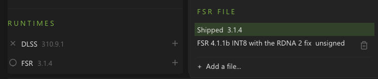</p>
- **Record a bug.** Each addon can keep the last few seconds of the frames it receives and save them (Ctrl+Shift+F5) as a file that plays the
  problem back on another computer.
- **Each addon's own settings, inline**, with its live status in the list and in the status bar. Sliders reset on double-click, show a tick at their default, and
  fine-tune with Ctrl+scroll.
- **Stays out of the way.** Opens with Lossless Scaling, hides to the notification area when you close it, and comes back with a click or **Ctrl+Shift+F12**.
- **Back up and restore** every setting to one file; a **diagnostics zip** of your logs and settings for a bug report (nothing is uploaded).
- **Setup that repairs itself:** one file installs, updates, repairs after a Lossless Scaling update and uninstalls, with a backup of everything it replaces.
- **Safe by design.** A faulting addon cannot take Lossless Scaling down with it, settings are written atomically, and a corrupt settings file is kept rather than
  overwritten. Optional SHA-256 checks of addon DLLs against a trust list.
- **Interface size** from 75% to 200%, sharp on any display. A daily **update check** (it only compares version numbers; it can be turned off).
- **Open to other addons:** LosslessProxy's addons load unchanged, and the SDK gives an addon the same look, icons and a panel of its own.

## Get started

1. Download `LSAddonManager-<version>-x64.zip` from the [releases page](https://github.com/Echo-Storm/ls-addon-manager/releases) and unzip it.
2. Close Lossless Scaling, then run **`LSAddonManagerSetup.exe`** from the zip. It looks for your Lossless Scaling folder (Steam or not; if it does not find it,
   choose **Use a different folder...**), says what state it is in, and offers the one thing that fits: **Install**, **Update**, **Repair** or **Uninstall**.
3. Start Lossless Scaling. The manager window opens by itself. Neural Rendering is on; switch on an upscaler in the list if you want one.

<table>
<tr>
<td valign="top" width="50%"><b>Setup, before installing</b><br>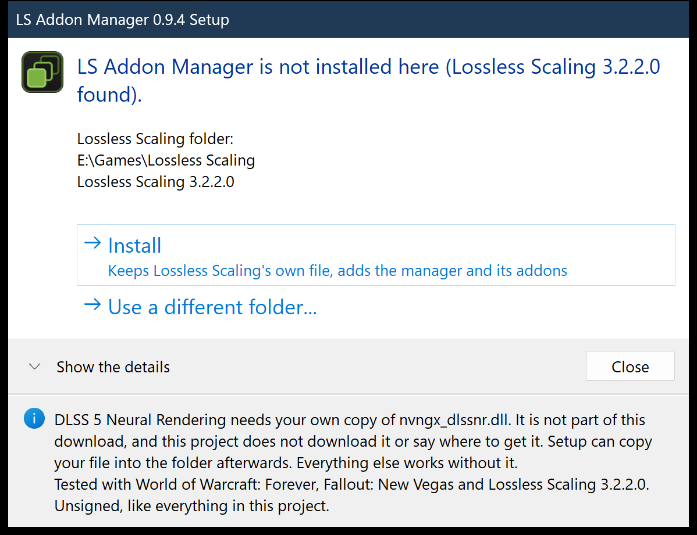</td>
<td valign="top" width="50%"><b>Setup, when it is done</b><br>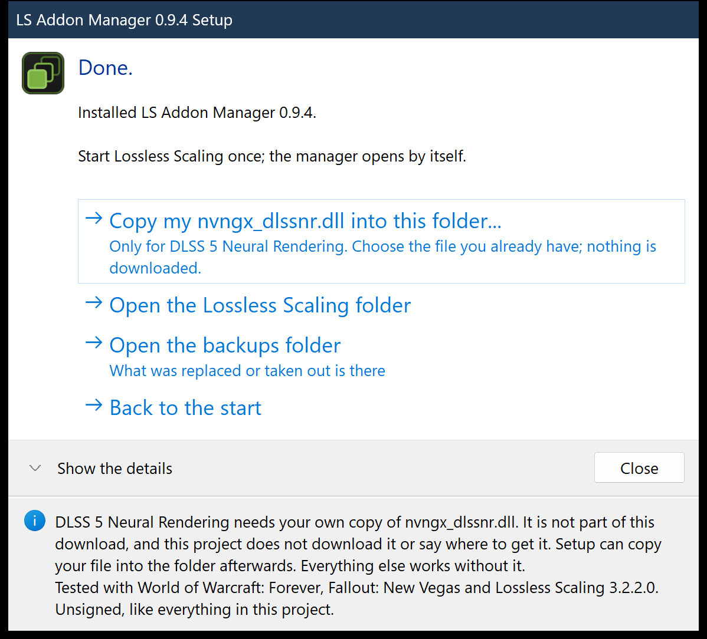</td>
</tr>
</table>

What Setup does, and does not do:

- It keeps Lossless Scaling's own `Lossless.dll` as `Lossless_original.dll` (the manager forwards to it) and puts the manager's `Lossless.dll`, two icon files and the `addons` folder in.
- **Everything it replaces is copied to a `backups` folder first, and nothing is deleted.** Every file is checked after copying, and if anything goes wrong it puts the folder back exactly as it was.
- It **never touches your settings** (`addons\config.json`), your other addons or the ones you removed.
- It refuses while Lossless Scaling is running from that folder, and says so. It runs without administrator rights, and offers to restart itself as administrator only when the folder needs it.
- After a **Lossless Scaling update**, which may put its own `Lossless.dll` back over ours, run Setup again: it offers **Repair** and keeps the new original.
- It can copy **your own** `nvngx_dlssnr.dll` into the folder afterwards. It never downloads anything, and neither does the manager (except the version check below).
- Like every file in this project it is **unsigned**, so Windows SmartScreen may warn you: choose *More info*, then *Run anyway*. Its source is in [`installer/`](installer/) and it is built and tested with the rest.

Prefer to do it by hand? See [Installing by hand](#installing-by-hand).

## Screenshots

<table>
<tr>
<td valign="top" width="50%"><b>DLSS 5 Neural Rendering</b><br>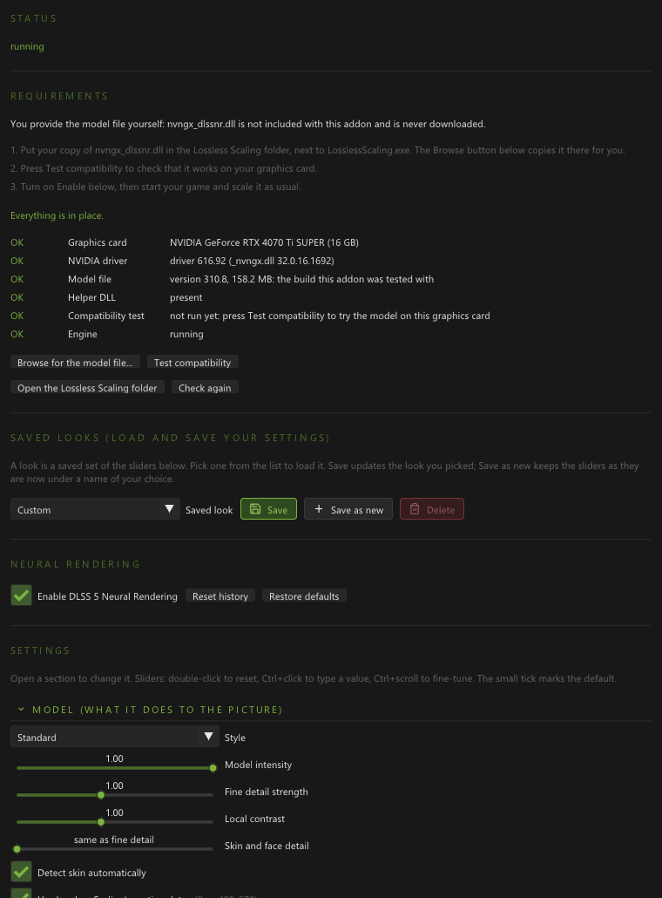</td>
<td valign="top" width="50%"><b>Performance</b><br>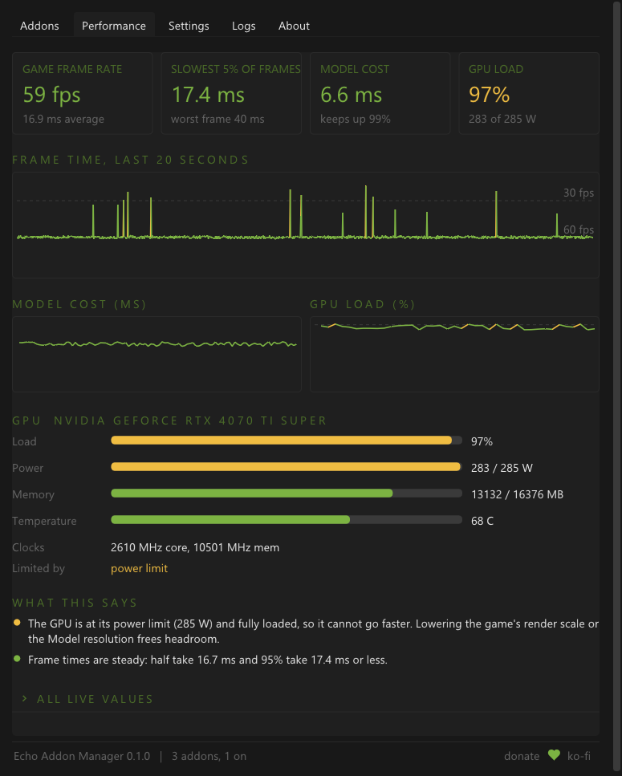</td>
</tr>
<tr>
<td valign="top"><b>Features</b><br>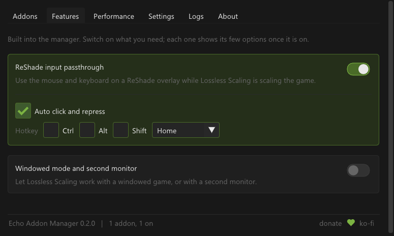</td>
<td valign="top"><b>Settings</b><br>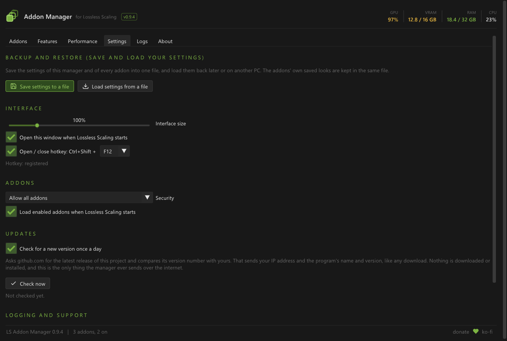</td>
</tr>
<tr>
<td valign="top" colspan="2"><b>About</b><br>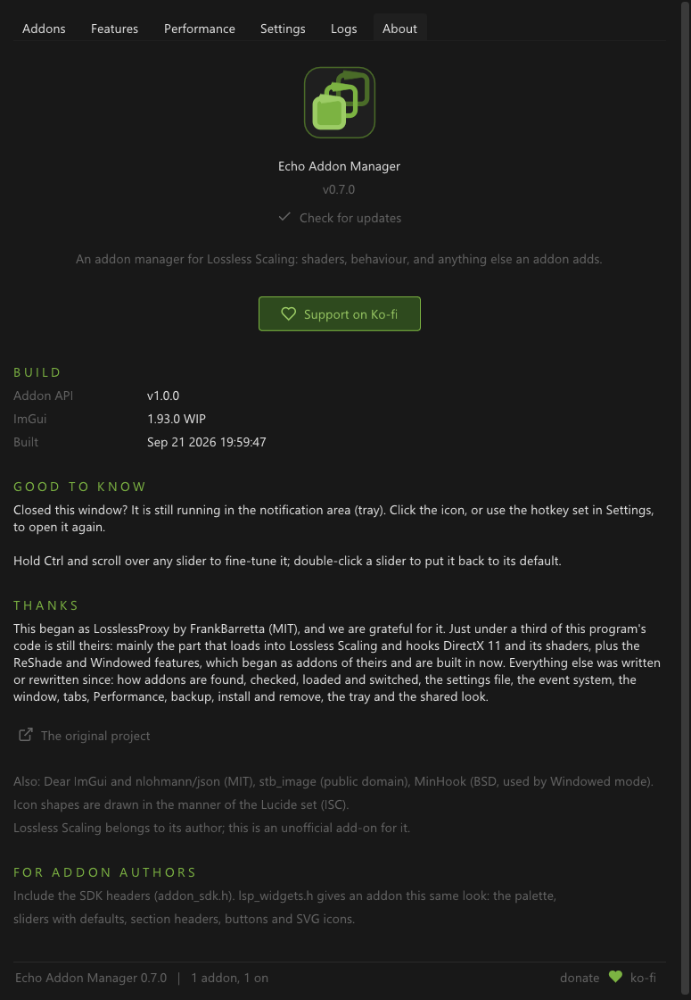</td>
</tr>
</table>

<p align="center">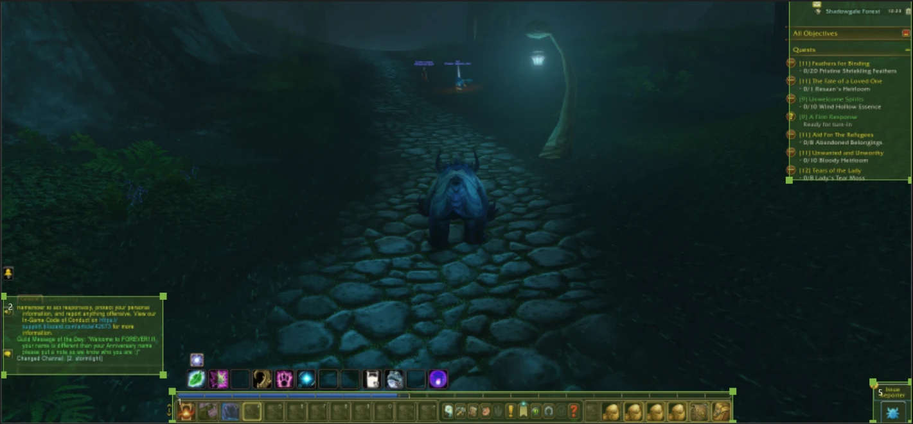</p>
<p align="center"><sub>Keep the HUD untouched: the areas are drawn on a snapshot of the game.</sub></p>

<sub>The window pictures are rendered offscreen by the project's own preview tool (`tools/ui_preview.ps1`), so the numbers in them are sample data, not a measurement.
The Neural Rendering panel comes from the offline test host.</sub>

## Using it

| Tab | What it does |
|-----|--------------|
| **Addons** | The addons in a slim list at the left, each with its icon, state and live status, and a switch, and the Runtimes list under them; the one you pick opens at the right with its own settings, an overview (description, tags, dependencies, errors) and its config file. |
| **Features** | The built-in features: ReShade input passthrough and Windowed mode. |
| **Performance** | Frame rate and frame times, addon cost, GPU load, power, clocks, temperature, memory, and a short reading of what is limiting you. |
| **Settings** | Backup and restore, interface size, open-at-start and the hotkey, updates, security level, log detail, the diagnostics file, and shortcuts to the logs and addons folders. |
| **Logs** | The last 10,000 entries with a level filter. |
| **About** | What comes with it, version and update status, credits, and the Ko-fi link. |

**Closing the window** does not stop anything: the manager hides to the notification area (Windows may keep its icon under the ^ arrow next to the clock).

### Hotkeys

They work while the game has focus; the Ctrl+Shift pair keeps them away from the game's own keys. Each addon can change its keys (Compare and hotkeys).

| Keys | What they do | Where |
|------|--------------|-------|
| Ctrl+Shift+F12 | Show or hide the manager window | the manager (Settings) |
| Ctrl+Shift+F6 | Before / after: the original picture (or Lossless Scaling's NIS) against ours | all three addons |
| Ctrl+Shift+F7 | Split view: the original at the left of a line, ours at the right | Neural Rendering |
| Ctrl+Shift+F8 / F9 | Sharpening down / up | all three addons |
| Ctrl+Shift+F10 | The next saved look | Neural Rendering |
| Ctrl+Shift+F11 | A screenshot of the picture as you see it | Neural Rendering |
| Ctrl+Shift+F5 | Save the recording (the last few seconds, when *Recording* is on) | all three addons |
| Home | ReShade input passthrough on and off | the manager (Features) |

## Keeping it up to date

**The update check.** Once a day the manager asks github.com whether a newer release of this project exists. If there is one, the status bar says "Update available",
and the About and Settings tabs show an **Open the download page** button. It is **on by default** and can be turned off in *Settings > Updates*; *Check now* always
works. It only compares version numbers: **nothing is downloaded or installed**, and it is the only thing the manager ever sends over the internet (GitHub sees your
IP address and the program's name and version, as with any download).

**To update:** download the new zip, close Lossless Scaling, run `LSAddonManagerSetup.exe` and choose **Update**. Your settings carry over.

## If something goes wrong

| What you see | What to do |
|--------------|-----------|
| The manager window does not appear after Lossless Scaling starts | A Lossless Scaling update may have put its own `Lossless.dll` back. Close Lossless Scaling and run Setup: it offers **Repair**. The manager may also just be hidden: look under the ^ arrow by the clock, or press Ctrl+Shift+F12. |
| Setup says Lossless Scaling is running | Close it (also from its notification-area icon), then press **Check again**. Setup will not change files that are in use. |
| Setup does not find your Lossless Scaling folder | Choose **Use a different folder...**, then **Browse for the folder...** and pick the one that holds `LosslessScaling.exe`. Setup remembers it. It already looks in Steam libraries and in usual places on every drive, such as `Utilities` and `Games`. |
| Setup wants to restart as administrator | The folder is in a protected place (Program Files, for example), where Windows only lets an administrator change files. Allow it, or use a copy of Lossless Scaling somewhere else. |
| Windows SmartScreen or your antivirus objects to a file | The files in this project are not signed. If your antivirus removes `nr_selftest.exe`, the *Test compatibility* button says the test program is missing; nothing else is affected. |
| Neural Rendering says the model file is missing | It needs your own `nvngx_dlssnr.dll` next to `LosslessScaling.exe`. Use Setup's **Copy my nvngx_dlssnr.dll...** or the addon's **Browse for the model file...**, then **Test compatibility**. |
| FSR 4 looks wrong, costs too much or does not start | Set *FSR version* back to **FSR 3.1.4 (AMD, shipped)** in the FSR Upscaler's panel (or **+** next to FSR in the Runtimes list). If a chosen file goes missing, the addon falls back to the shipped one by itself. |
| The Runtimes list shows a circle or a cross | A circle means the addon is on and waits for a game to be scaled; a cross means the addon is off. A file is only loaded once Lossless Scaling scales a game with that addon on (for the upscalers, with **NIS** as the Scaling Type). |
| Something looks wrong in a game | Turn on *Recording* in the addon's panel, make it happen, press **Ctrl+Shift+F5**, and attach the `.lsrec` file (in `Videos\Lossless Scaling`) to your report: it lets us play the problem back. |
| An upscaler is on but the picture looks like NIS | Choose **NIS** as the Scaling Type in Lossless Scaling: the upscalers take the place of that pass. The panel's status line says what it is doing; the [upscalers' guide](addons/DLSS5NR01/docs/upscalers.md#when-something-is-wrong) has the rest. |
| Windowed mode does nothing | Its virtual display has to be in place before Lossless Scaling starts, so after switching it on, restart Lossless Scaling. |
| A question that is not here | The [questions and answers](docs/faq.md) cover the rest, and [model compatibility](docs/model-compatibility.md) lists which model builds have been reported to work on which cards. |
| Something else, or you want to undo it | Run Setup and choose **Uninstall** (your addons and settings stay, or take the addons out too). What was replaced is in the `backups` folder. To report a bug, make a **diagnostics file** on the Settings tab: it collects your logs and settings into a zip and uploads nothing. |

## Installing by hand

Setup does exactly this, with backups. If you would rather copy files yourself:

1. Close Lossless Scaling. Open its folder (for a Steam install, for example `C:\Program Files (x86)\Steam\steamapps\common\Lossless Scaling`).
2. **First time only:** rename the original `Lossless.dll` to `Lossless_original.dll`. Keep it: the manager forwards to it.
3. Copy `Lossless.dll`, the two `manager-icon` files (`.ico` and `.png`) and the `addons` folder from the zip into that folder.
4. Start Lossless Scaling. For Neural Rendering, also put your `nvngx_dlssnr.dll` next to `LosslessScaling.exe`.

**Updating by hand:** close Lossless Scaling and copy the new `Lossless.dll` and `addons` over the old ones.
**After a Lossless Scaling update:** delete the stale `Lossless_original.dll`, rename the new `Lossless.dll` to `Lossless_original.dll`, and copy ours in again.
**Uninstalling by hand:** delete our `Lossless.dll`, rename `Lossless_original.dll` back to `Lossless.dll`, and delete the `addons` folder if you like.

Files the manager reads and writes, all inside the Lossless Scaling folder except the recordings:

| File | What |
|------|------|
| `addons\config.json` | Every addon's on/off state and settings, and the manager's (`global`). Written to a temporary file and swapped in; an unreadable one is kept as `config.json.corrupt`. |
| `addons\trusted_addons.json` | Optional: `{ "<addon id>": ["<sha256 of its DLL>"] }`, used by the Security setting. |
| `addons\.removed\` | Addons you removed, each in a folder with a timestamp. |
| `backups\` | What Setup replaced, and copies of settings made before a restore replaced them. |
| `addons\<addon>\runtimes\` | Runtime files added with **+** in the Runtimes list (and the FSR 4 build the FSR Upscaler comes with), one folder each. Updates leave them alone. |
| `Videos\Lossless Scaling\*.lsrec` | Recordings (outside the Lossless Scaling folder: in your Videos folder, or your profile's own when Videos is synced by OneDrive). |
| `logs\LSAddonManager.log` | The manager's log. It rolls over to `.old` at 8 MB. The addons write their own logs here too (`DLSS5NR01.log`, `DLSS4DLAA.log`, `FSR3UPSC.log`). |

## How it works

```
LosslessScaling.exe
  └─ loads Lossless.dll          <- LS Addon Manager (takes the original's place)
       ├─ loads Lossless_original.dll (the real engine) and forwards its exports untouched
       ├─ watches DirectX 11 compute work and shader loading, for addons that ask
       ├─ loads addons from addons\
       └─ draws the manager window with Dear ImGui on its own thread
```

Because it loads as a proxy DLL, nothing in Lossless Scaling is patched on disk and removing it puts everything back. Addons share the manager's Dear ImGui context,
so they draw their settings inline and look the same.

The three addons run their GPU work on a Direct3D 12 device of their own, beside Lossless Scaling's Direct3D 11 one; the two share textures and fences, and every wait
between them is a GPU wait, so Lossless Scaling's render thread never stops for an addon. Neural Rendering hooks the frame Lossless Scaling captures (or presents);
the upscalers recognise its NIS pass by what it binds and put their picture in its output. The architecture notes are in
[addons/DLSS5NR01/docs/architecture.md](addons/DLSS5NR01/docs/architecture.md).

Setup never loads either `Lossless.dll` to tell them apart: it reads their version resources (Lossless Scaling's says "Lossless Scaling", ours says "Addon Manager for Lossless Scaling").

## Build from source

Visual Studio 2022 (Desktop C++ workload) and CMake 3.20+ on Windows. Dear ImGui and MinHook are fetched at pinned versions when CMake first configures.

```powershell
powershell -File tools\build_all.ps1                     # the manager and the addons (Neural Rendering and the two upscalers)
powershell -File tools\build_all.ps1 -Only host          # the manager only
powershell -File tools\run_addon_tests.ps1               # the offline tests for what changed since the last commit (-All: every one, -List: the suites)
powershell -File tools\ci.ps1                            # what the GitHub build runs: a clean build of the manager, installer and sample addon, and the tests that need no GPU
powershell -File tools\package.ps1                       # the release zip, with the Setup exe built around the files
powershell -File tools\ui_preview.ps1                    # the window rendered offscreen (the screenshots above; EAM_PREVIEW_CLEAN=1 for the tidy scene)
```

Building the addons from source (not needed to use the release zip) also needs NVIDIA's DLSS SDK headers and static library in `addons/DLSS5NR01/external/ngx`:
`tools\fetch_ngx_sdk.ps1` fetches them from NVIDIA's public repository after you accept NVIDIA's licence. They are NVIDIA's, under NVIDIA's licence, so they are not in
this repository; the release carries the parts it needs under NVIDIA's terms (see NOTICE.md). The FSR Upscaler loads AMD's FidelityFX runtime:
`tools\fetch_ffx_sdk.ps1` fetches it from AMD's repository and checks it (a pinned SHA-256 and AMD's signature). It is MIT-licensed, like the FidelityFX API headers in
`addons/DLSS5NR01/third_party/ffx`. `tools\fetch_fsr4.ps1` fetches the FSR 4.1.1b build the FSR Upscaler offers as its second choice (a pinned SHA-256; 7-Zip
needed); it is AMD's upscaler as changed by the OptiScaler team, under AMD's FidelityFX SDK licence (`third_party/ffx4`). The addons' offline test host and its scenario matrix (`tools\run_hosttest_matrix.py`) exercise every path without Lossless Scaling.
`tools\deploy.ps1 -What all -LsDir <Lossless Scaling folder>` copies a build into a Lossless Scaling folder with backups and refuses to run while Lossless Scaling or
your game is open. The installer is its own small CMake project in [`installer/`](installer/).

## Writing an addon

**Addons written for LosslessProxy work here too.** The addon interface began as LosslessProxy's and has only grown at the end: an addon built for LosslessProxy 0.3.0
exports the same functions (including the older `AddonInit` name), gets the same `IHost` with its calls in the same places, and receives the same events and
capability bits, so the DLL loads unchanged; drop its folder into `addons\`. One caution: addons draw their settings with the manager's Dear ImGui, and LosslessProxy
built against whatever the docking branch was at the time, while this manager pins one commit. An addon with a settings panel should be rebuilt against this SDK
(`manager/sdk/include/eam`) before its panel is trusted; if the panel faults anyway, the manager switches that panel off instead of going down with it. The promise for
the interface, and a test that holds today's host to the 1.0 layout, are in [docs/api-compatibility.md](docs/api-compatibility.md).

Start from the [sample addon](examples/SampleAddon): a small, commented, tested addon with settings, a panel in the manager's look, a status line and a metric. An
addon can ship an `icon.svg` (its shapes are drawn in the manager's colours at any size) or a picture. Then see [docs/addon-authors.md](docs/addon-authors.md) for the
exports, the host interface, live status and metrics, the shared look and the rules that are easy to trip over.

## Credits

Addon Manager for Lossless Scaling began as [LosslessProxy](https://github.com/FrankBarretta/LosslessProxy) by **FrankBarretta**, and we are grateful for it: its idea
of a proxy `Lossless.dll` with addons, its addon interface (which is why its addons still load here) and the ReShade and Windowed features, which started there as
addons. The manager's code has since been rewritten; about a tenth of its lines still match the original's, mostly declarations and common idioms
(`tools/measure_original_share.py` measures it). Neural Rendering began as **andreiday**'s DLSS 5 plugin for LosslessProxy and has been rewritten and extended here;
fewer than one line in ten still matches theirs. The upscalers run NVIDIA DLSS and AMD FidelityFX Super Resolution (FSR 3.1 from AMD's FidelityFX SDK, MIT; FSR 4 under AMD's FidelityFX SDK licence, as
built by the OptiScaler team, with thanks); their motion
measurement, stability and edge smoothing are this project's own. The full list, with licences, is in [NOTICE.md](NOTICE.md). NVIDIA, DLSS, AMD, FidelityFX and FSR
are trademarks of their owners; this project is not affiliated with or endorsed by them. Lossless Scaling belongs to its author; this project is unofficial.

If it is useful to you, you can [support it on Ko-fi](https://ko-fi.com/xechostormx).

MIT licence: [LICENSE](LICENSE). [Changelog](CHANGELOG.md). [Roadmap](ROADMAP.md).
