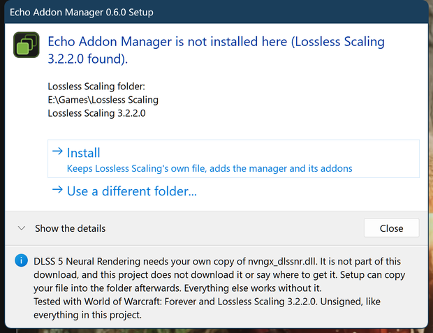

<p align="center"></p>

<p align="center"><b>The addon manager for Lossless Scaling.</b><br>Install, switch on and tune addons from one window, and watch your frame rate and GPU while you play.</p>

> [!IMPORTANT]
> **DLSS 5 Neural Rendering needs a file you provide yourself.** It needs your own copy of `nvngx_dlssnr.dll`. That file is **not included** in this
> download, this project **does not download it**, and it does not say where to get it. Put your copy in the Lossless Scaling folder, next to
> `LosslessScaling.exe` (Setup and the addon's **Browse for the model file...** button can copy it there for you), then press **Test compatibility** in the addon's panel.
> Everything else here, including the manager, ReShade input passthrough and Windowed mode, works without it.

> [!NOTE]
> **Tested with World of Warcraft: Forever.** This project was developed and tested against **World of Warcraft: Forever** (the beta; it runs as `WowB.exe`), on Lossless Scaling 3.2.2.0, Windows 11 and an RTX 4070 Ti SUPER. Other games and setups are untested. DLSS 5 Neural Rendering in particular has only been
> tried in World of Warcraft: Forever.

**Echo Addon Manager** loads alongside [Lossless Scaling](https://store.steampowered.com/app/993090/Lossless_Scaling/) and gives it an addon system: one window to install, switch on and tune
addons, a live view of frame time and GPU load while a game runs, and one-click backup of every setting. It comes with the **DLSS 5 Neural Rendering** addon and two built-in features,
**ReShade input passthrough** and **Windowed mode**. It is free and MIT-licensed. It is an unofficial project, not affiliated with the Lossless Scaling developers: read the
[disclaimer](DISCLAIMER.md) before you install it.

Status: **0.6.0**, on the way to 1.0 (the [roadmap](ROADMAP.md) says what is left). You need Lossless Scaling 3.2.2.0 and Windows 10 or 11, x64.

## Get started

1. Download `EchoAddonManager-<version>-x64.zip` from the [releases page](https://github.com/Echo-Storm/echo-addon-manager/releases) and unzip it.
2. Close Lossless Scaling, then run **`EchoAddonManagerSetup.exe`** from the zip. It looks for your Lossless Scaling folder (Steam or not; if it does not find it, choose **Use a different folder...**),
   says what state it is in, and offers the one thing that fits: **Install**, **Update**, **Repair** or **Uninstall**.
3. Start Lossless Scaling. The manager window opens by itself.

<table>
<tr>
<td valign="top" width="50%"><b>Setup, before installing</b><br></td>
<td valign="top" width="50%"><b>Setup, when it is done</b><br></td>
</tr>
</table>

What Setup does, and does not do:

- It keeps Lossless Scaling's own `Lossless.dll` as `Lossless_original.dll` (the manager forwards to it) and puts the manager's `Lossless.dll`, two icon files and the `addons` folder in.
- **Everything it replaces is copied to a `backups` folder first, and nothing is deleted.** Every file is checked after copying, and if anything goes wrong it puts the folder back exactly as it was.
- It **never touches your settings** (`addons\config.json`), your other addons or the ones you removed.
- It refuses while Lossless Scaling is running from that folder, and says so. It runs without administrator rights, and offers to restart itself as administrator only when the folder needs it.
- After a **Lossless Scaling update**, which may put its own `Lossless.dll` back over ours, run Setup again: it offers **Repair** and keeps the new original.
- It can copy **your own** `nvngx_dlssnr.dll` into the folder afterwards. It never downloads anything, and neither does the manager (except the version check below).
- Like every file in this project it is **unsigned**, so Windows SmartScreen may warn you: choose *More info*, then *Run anyway*. Its source is in [`installer/`](installer/) and it is built and tested with the rest.

Prefer to do it by hand? See [Installing by hand](#installing-by-hand).

<table>
<tr>
<td valign="top" width="50%"><b>Addons</b><br></td>
<td valign="top" width="50%"><b>DLSS 5 Neural Rendering</b><br></td>
</tr>
<tr>
<td valign="top"><b>Performance</b><br></td>
<td valign="top"><b>Settings</b><br></td>
</tr>
<tr>
<td valign="top"><b>Features</b><br></td>
<td valign="top"><b>About</b><br></td>
</tr>
</table>

<sub>These pictures are rendered offscreen by the project's own preview tool (`tools/ui_preview.ps1`), so the Performance numbers and log lines are sample data, not a
measurement. The Neural Rendering panel comes from the offline test host.</sub>

## What you get

- **An addon manager that stays out of the way.** It opens with Lossless Scaling, hides to the notification area when you close it, and comes
  back with a click on its icon or **Ctrl+Shift+F12** (you can change the key). Every control has a tooltip.
- **Install and remove addons without touching folders.** *Install addon* takes a folder, a zip or a lone DLL, or drop one on the window. New
  addons arrive switched off. *Remove* moves an addon into `addons\.removed` after asking; nothing is ever erased.
- **Each addon's own settings, inline.** Sliders that reset on double-click, show a small tick where the default is, and fine-tune with Ctrl+scroll.
- **A live Performance tab.** Game frame rate and frame time (average, slowest 5%, worst), what each addon costs, and your GPU's load, power
  against its limit, clocks, temperature and memory, with a plain-words summary ("the GPU is at its power limit"). GPU numbers come from NVIDIA's
  own driver library and are only read while the tab is open.
- **Live status on the addon card and in the status bar**, published by the addon itself.
- **Back up and restore.** Save every addon's settings and the manager's to one file; load it back after a confirmation (the current settings are
  kept aside first). One button makes a **diagnostics zip** with your logs and settings for a bug report; nothing is uploaded anywhere.
- **Interface size** from 75% to 200%, sharp on any display, per-monitor DPI aware.
- **Safe by design.** A faulting addon cannot take Lossless Scaling down with it, settings are written atomically, and a corrupt settings file is
  kept rather than overwritten. Optional SHA-256 checks of addon DLLs against a trust list.

### What ships with it

Two **built-in features**, on the Features tab, each a switch with a few options that appear once it is on. They started as addons of the original project and are part of the manager now.

| Feature | What it does | Default |
|---------|--------------|---------|
| **ReShade input passthrough** | Lets the mouse and keyboard reach a ReShade overlay while Lossless Scaling is scaling the game. A hotkey (Home by default) turns it on and off; it can be switched on at any time. | off |
| **Windowed mode and second monitor** | Adds a virtual display the size of your game window so Lossless Scaling can work with a windowed game or a second monitor, with split-screen and side-by-side options. It must be in place before Lossless Scaling starts, so switching it on needs a restart; switching it off is immediate. | off |

And one **addon**, which is separate because it needs an NVIDIA GPU and a file you supply:

| Addon | What it does | Default |
|-------|--------------|---------|
| **DLSS 5 Neural Rendering** | Runs NVIDIA's DLSS 5 neural model on the frames Lossless Scaling captures and applies the result to every frame it presents, real and generated, without ever making Lossless Scaling wait. Saved looks, per-game looks, HUD protection, shadows and highlights, colour, film grain and temporal smoothing. Needs an NVIDIA RTX GPU and a copy of `nvngx_dlssnr.dll` that you supply. [More](addons/DLSS5NR01/README.md) | on |

## Using it

| Tab | What it does |
|-----|--------------|
| **Addons** | Every addon with its state, version and author, a live status line, and a switch. Click one to open its own settings, an overview (description, tags, dependencies, errors) and its config file. |
| **Features** | The built-in features: ReShade input passthrough and Windowed mode. |
| **Performance** | Frame rate and frame time, addon cost, GPU load, power, clocks, temperature, memory, and a short reading of what is limiting you. |
| **Settings** | Backup and restore, interface size, open-at-start and the hotkey, updates, security level, log detail, the diagnostics file, and shortcuts to the logs and addons folders. |
| **Logs** | The last 10,000 entries with a level filter. |
| **About** | Version, update status, credits, and the Ko-fi link. |

**Closing the window** does not stop anything: the manager hides to the notification area (Windows may keep its icon under the ^ arrow next to the clock).

## Keeping it up to date

**The update check.** Once a day the manager asks github.com whether a newer release of this project exists. If there is one, the status bar says "Update available", and the About and Settings tabs
show an **Open the download page** button. It is **on by default** and can be turned off in *Settings > Updates*; *Check now* always works. It only compares version numbers: **nothing is downloaded or
installed**, and it is the only thing the manager ever sends over the internet (GitHub sees your IP address and the program's name and version, as with any download).

**To update:** download the new zip, close Lossless Scaling, run `EchoAddonManagerSetup.exe` and choose **Update**. Your settings carry over.

## If something goes wrong

| What you see | What to do |
|--------------|-----------|
| The manager window does not appear after Lossless Scaling starts | A Lossless Scaling update may have put its own `Lossless.dll` back. Close Lossless Scaling and run Setup: it offers **Repair**. The manager may also just be hidden: look under the ^ arrow by the clock, or press Ctrl+Shift+F12. |
| Setup says Lossless Scaling is running | Close it (also from its notification-area icon), then press **Check again**. Setup will not change files that are in use. |
| Setup does not find your Lossless Scaling folder | Choose **Use a different folder...**, then **Browse for the folder...** and pick the one that holds `LosslessScaling.exe`. Setup remembers it. It already looks in Steam libraries and in usual places on every drive, such as `Utilities` and `Games`. |
| Setup wants to restart as administrator | The folder is in a protected place (Program Files, for example), where Windows only lets an administrator change files. Allow it, or use a copy of Lossless Scaling somewhere else. |
| Windows SmartScreen or your antivirus objects to a file | The files in this project are not signed (see [the roadmap](ROADMAP.md)). If your antivirus removes `nr_selftest.exe`, the *Test compatibility* button says the test program is missing; nothing else is affected. |
| Neural Rendering says the model file is missing | It needs your own `nvngx_dlssnr.dll` next to `LosslessScaling.exe`. Use Setup's **Copy my nvngx_dlssnr.dll...** or the addon's **Browse for the model file...**, then **Test compatibility**. |
| Windowed mode does nothing | Its virtual display has to be in place before Lossless Scaling starts, so after switching it on, restart Lossless Scaling. |
| Something else, or you want to undo it | Run Setup and choose **Uninstall** (your addons and settings stay, or take the addons out too). What was replaced is in the `backups` folder. To report a bug, make a **diagnostics file** on the Settings tab: it collects your logs and settings into a zip and uploads nothing. |

## Installing by hand

Setup does exactly this, with backups. If you would rather copy files yourself:

1. Close Lossless Scaling. Open its folder (for a Steam install, for example `C:\Program Files (x86)\Steam\steamapps\common\Lossless Scaling`).
2. **First time only:** rename the original `Lossless.dll` to `Lossless_original.dll`. Keep it: the manager forwards to it.
3. Copy `Lossless.dll`, the two `LP-icon` files and the `addons` folder from the zip into that folder.
4. Start Lossless Scaling. For Neural Rendering, also put your `nvngx_dlssnr.dll` next to `LosslessScaling.exe`.

**Updating by hand:** close Lossless Scaling and copy the new `Lossless.dll` and `addons` over the old ones.
**After a Lossless Scaling update:** delete the stale `Lossless_original.dll`, rename the new `Lossless.dll` to `Lossless_original.dll`, and copy ours in again.
**Uninstalling by hand:** delete our `Lossless.dll`, rename `Lossless_original.dll` back to `Lossless.dll`, and delete the `addons` folder if you like.

Files the manager reads and writes, all inside the Lossless Scaling folder:

| File | What |
|------|------|
| `addons\config.json` | Every addon's on/off state and settings, and the manager's (`global`). Written to a temporary file and swapped in; an unreadable one is kept as `config.json.corrupt`. |
| `addons\trusted_addons.json` | Optional: `{ "<addon id>": ["<sha256 of its DLL>"] }`, used by the Security setting. |
| `addons\.removed\` | Addons you removed, each in a folder with a timestamp. |
| `backups\` | What Setup replaced, and copies of settings made before a restore replaced them. |
| `logs\EchoAddonManager.log` | The manager's log. It rolls over to `.old` at 8 MB. Addons may write their own log files here too (Neural Rendering does). |

## How it works

```
LosslessScaling.exe
  └─ loads Lossless.dll          <- Echo Addon Manager (takes the original's place)
       ├─ loads Lossless_original.dll (the real engine) and forwards its exports untouched
       ├─ watches DirectX 11 compute work and shader loading, for addons that ask
       ├─ loads addons from addons\
       └─ draws the manager window with Dear ImGui on its own thread
```

Because it loads as a proxy DLL, nothing in Lossless Scaling is patched on disk and removing it puts everything back. Addons share the manager's
Dear ImGui context, so they draw their settings inline and look the same.

Setup never loads either `Lossless.dll` to tell them apart: it reads their version resources (Lossless Scaling's says "Lossless Scaling", ours says "Echo Addon Manager").

## Build from source

Visual Studio 2022 (Desktop C++ workload) and CMake 3.20+ on Windows. Dear ImGui and MinHook are fetched at pinned versions when CMake first configures.

```powershell
powershell -File tools\build_all.ps1                     # manager and Neural Rendering
powershell -File tools\build_all.ps1 -Only host          # the manager only
powershell -File tools\run_addon_tests.ps1               # offline tests, no game needed (the window tests show a window for a moment)
powershell -File tools\package.ps1                       # the release zip, with the Setup exe built around the files
```

Building Neural Rendering from source (not needed to use the release zip) also needs NVIDIA's DLSS SDK headers and static library in
`addons/DLSS5NR01/external/ngx`: `tools\fetch_ngx_sdk.ps1` fetches them from NVIDIA's public repository after you accept NVIDIA's licence. They are not redistributable, so they are not in this repository.
`tools\deploy.ps1 -What all -LsDir <Lossless Scaling folder>` copies a build into a Lossless Scaling folder with backups and refuses to run while Lossless Scaling or your game is open.
The installer is its own small CMake project in [`installer/`](installer/).

## Writing an addon

See [docs/addon-authors.md](docs/addon-authors.md): the exports, the host interface, live status and metrics, the shared look, and the rules that are easy to trip over.

## Credits

Echo Addon Manager began as [LosslessProxy](https://github.com/FrankBarretta/LosslessProxy) by **FrankBarretta**, and we are grateful for it. Just under a third
of the manager's code (mainly the proxy DLL and the DirectX 11 and shader hooks) is still theirs, and the ReShade and Windowed features started there as
addons; the rest, including how addons are found, checked and loaded, the settings file, the event system, the window and the live status and metrics,
was written or rewritten since (`tools/measure_original_share.py` measures it). Neural Rendering is by **andreiday**, extended here. The full list, with licences, is in [NOTICE.md](NOTICE.md). Lossless Scaling belongs to its author; this project is unofficial.

If it is useful to you, you can [support it on Ko-fi](https://ko-fi.com/xechostormx).

MIT licence: [LICENSE](LICENSE). [Changelog](CHANGELOG.md). [Roadmap](ROADMAP.md).
